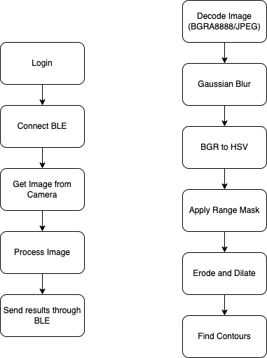

# 小球追踪APP
项目：小球追踪APP
| 更新日期 | 作者 | 版本 | 备注 |
| -------- | -------- | -------- | -------- |
| 16/9/2023 | 苏伟铭 | 1.0 | 初始版本 |
- [小球追踪APP](#小球追踪app)
  - [1. 业务概览](#1-业务概览)
    - [1.1 概览](#11-概览)
    - [1.2 相关文档](#12-相关文档)
    - [1.3 假设](#13-假设)
    - [1.4 问题/澄清记录](#14-问题澄清记录)
  - [2. 功能需求](#2-功能需求)
    - [2.1 流程概述](#21-流程概述)
      - [2.1.1 Connect BLE](#211-connect-ble)
      - [2.1.2 Stream Screen](#212-stream-screen)
    - [2.2 项目与依赖](#22-项目与依赖)
      - [2.2.1 编译指南](#221-编译指南)
    - [2.3 可拓展性与未来增强](#23-可拓展性与未来增强)
    - [2.4 用户界面：UI布局](#24-用户界面ui布局)
      - [2.4.1 Connect BLE](#241-connect-ble)
      - [2.4.2 Stream Screen](#242-stream-screen)
    - [2.5 用户界面：UI输入与验证](#25-用户界面ui输入与验证)
      - [2.5.1 Connect BLE](#251-connect-ble)
      - [2.5.2 Stream Screen](#252-stream-screen)
  - [3. 依赖、设计约束和其他考虑因素](#3-依赖设计约束和其他考虑因素)
    - [3.1 设计思路](#31-设计思路)
    - [3.2 状态管理](#32-状态管理)
  - [4. 异常情况](#4-异常情况)
    - [4.1 已知异常](#41-已知异常)
  - [5. 测试需求](#5-测试需求)
    - [5.1 测试条件](#51-测试条件)
  - [6. 附加信息](#6-附加信息)
    - [6.1 硬件描述](#61-硬件描述)
    - [6.2 术语表](#62-术语表)
  - [7. 附录](#7-附录)

## 1. 业务概览
### 1.1 概览
待写

### 1.2 相关文档
| 文档名 | 作者 | 内容描述 |
| -------- | -------- | -------- |
| - | - | - |
### 1.3 假设
1. 球与背景色差较大
2. 本解决方案使用纯计算机视觉方式，无任何机器学习

### 1.4 问题/澄清记录
无
## 2. 功能需求
### 2.1 流程概述


图1：项目流程图
#### 2.1.1 Connect BLE
根据图1中的流程，用户在本界面进行以下操作：
1. 打开APP。
2. 点击Connect按钮与该列BLE设备进行连接。
3. 下拉重新扫描BLE。
4. 点击Disconnect断开连接。

| 操作 | 用户 | 系统 | 备注 |
| ------ | ------ | ------ | ------ |
| 打开App | 单击 | - | - |
| 连接BLE | 单击 | 连接BLE设备 | - |
| 扫描BLE | 下拉 | 重新扫描BLE | - |
| 断开连接 | 单击 | 断开已连接的BLE设备 | 连接后显示 |
#### 2.1.2 Stream Screen
根据图1中的流程，用户在本界面进行以下操作：
1. 点击悬浮按钮开始或结束串流，从摄像头获取图像并用opencv按照图1流程处理。
2. 滑动slider调整kp。
3. 滑动slider调整ki。
4. 滑动slider调整kd。

| 操作 | 用户 | 系统 | 备注 |
| ------ | ------ | ------ | ------ |
| 开始/结束串流 | 单击 | 开始或结束串流 | - |
| 调整kp | slider | 实时调整pid参数 | - |
| 调整ki | slider | 实时调整pid参数 | - |
| 调整kd | slider | 实时调整pid参数 | - |

### 2.2 项目与依赖
此项目使用Flutter编写，计算机视觉部分调用了OpenCV c++的接口。Flutter与OpenCV使用`dart:ffi`接入。
#### 2.2.1 编译指南
Please install OpenCV iOS Framework and put it at location `ios/opencv2.framework`

In project root directory,
```flutter pub get```

```flutter run -d <your device>```


### 2.3 可拓展性与未来增强
我们借此项目提出一种“算力共享”的概念，即最大化使用我们所拥有的计算资源。我们日常生活中时常有很多算力过剩的情况出现，我们的手机，电脑，甚至智能手表大部分时间都不是满载运行的，甚至过半时间是空载状态下。因此我们想怎么才能最大化使用这些算力。用手机作为机器人的处理器算是算力共享的方法之一。

我们一共总结出以下优势：
1. 降低硬件成本
2. 最大化硬件使用率，减少浪费
3. 方便更新硬件
4. 可拓展性强
5. 硬件不需联网，安全性强

例子包括智能家居中我们可以做到使用时才把算力模块加上，或一些我们不会同时使用的电子产品，能够共享同一个算力源。这样我们成功把算力模块化，进而能够将其代币化，而能够进行一种“算力交易”。而手机作为一个强大又便携的算力模块，能够为很多事物提供算力支持。

### 2.4 用户界面：UI布局
#### 2.4.1 Connect BLE


#### 2.4.2 Stream Screen


### 2.5 用户界面：UI输入与验证
#### 2.5.1 Connect BLE
无
#### 2.5.2 Stream Screen
无

## 3. 依赖、设计约束和其他考虑因素
### 3.1 设计思路
。。。

### 3.2 状态管理
项目无状态管理。

## 4. 异常情况
### 4.1 已知异常
无

## 5. 测试需求
### 5.1 测试条件
此项目未编写单元测试，综合测试和e2e测试。

## 6. 附加信息
无
### 6.1 硬件描述
无
### 6.2 术语表
无

## 7. 附录
* [OpenCV iOS Framework](https://sourceforge.net/projects/opencvlibrary/files/4.5.3/opencv-4.5.3-ios-framework.zip/download)
* [OpenCV Android Framework](https://sourceforge.net/projects/opencvlibrary/files/4.5.3/opencv-4.5.3-android-sdk.zip/download)
* [About FFI](https://www.youtube.com/watch?v=2MMK7YoFgaA)
* [Android config](https://www.flutterclutter.dev/flutter/tutorials/implementing-edge-detection-in-flutter/2020/1509/)
* [iOS config](https://www.raywenderlich.com/21512310-calling-native-libraries-in-flutter-with-dart-ffi#toc-anchor-015)
* [Flutter CameraController](https://flutter.dev/docs/cookbook/plugins/picture-using-camera)
* [Flutter startImageStream](https://pub.dev/documentation/camera/latest/camera/CameraController/startImageStream.html)
* [Image Format Group](https://github.com/flutter/flutter/issues/26348#issuecomment-796566914)
* [Flutter Blue Plus](https://pub.dev/packages/flutter_blue_plus)